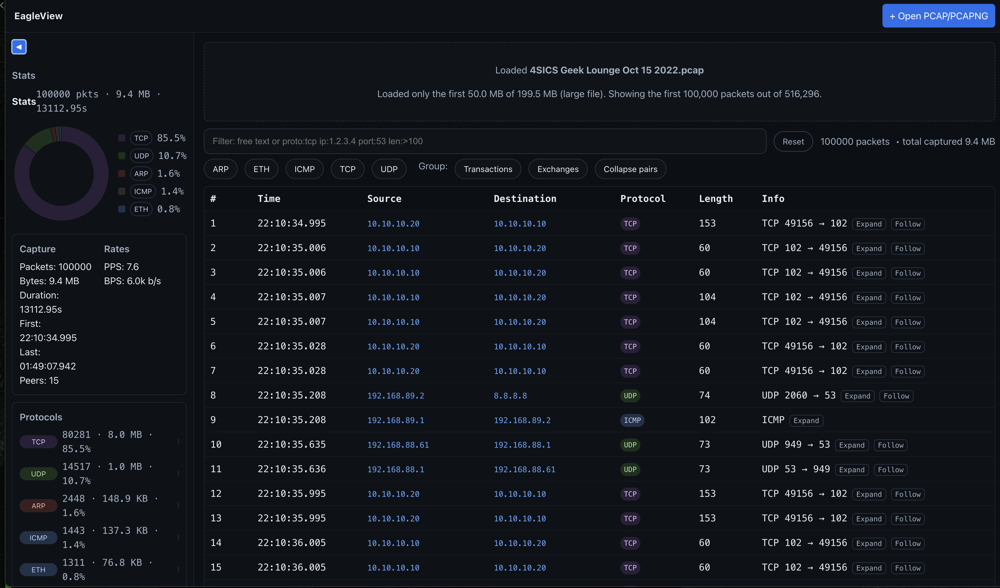

# EagleEyes



## Introduction

EagleEyes aims to decode net traffic and analyse it using pcap to ensure security purposes.

### Browser (WASM) integration for EagleView (React)
EagleView (the React dashboard) now uses the Rust decoders compiled to WebAssembly via a new crate `crates/protocol-wasm`. Capture and native tools remain in the Rust binaries; the browser only decodes bytes.

- Build the WASM package
```sh path=null start=null
cargo install wasm-pack
wasm-pack build crates/protocol-wasm --target bundler --release
```

- Install into the dashboard and enable WASM in Vite
```sh path=null start=null
npm --prefix eagleview i ./crates/protocol-wasm/pkg
npm --prefix eagleview i -D vite-plugin-wasm
```
Update Vite config to load `.wasm`:
```ts path=null start=null
import { defineConfig } from 'vite'
import react from '@vitejs/plugin-react'
import wasm from 'vite-plugin-wasm'
export default defineConfig({ plugins: [react(), wasm()] })
```

- Use from React (Uint8Array in, JSON out)
```ts path=null start=null
import { decode_packet } from 'protocol-wasm'
// Given a ParsedPacket with .data: Uint8Array
const dec = decode_packet(pkt.data)
// dec: { l2?, l3?, l4?, summary, protocolTag, appTag? }
```

Notes
- `pcap` is native-only and is automatically excluded from `wasm32` builds; native binaries (capture/from_file) are unchanged.
- The dashboard still parses pcap/pcapng in JS; only per-packet decoding now comes from Rust.

### Supported protocols (decoder coverage)
Layer 2 / 2.5
- Ethernet II (Ethertype)
- IEEE 802.3 + LLC/SNAP
- VLAN 802.1Q (single-tag)
- STP (Spanning Tree, minimal BPDU)
- LLDP (minimal TLVs)
- CDP (minimal TLVs)
- PPP over Ethernet (PPPoE Discovery/Session; IPv4/IPv6 dispatch)
- PPP (LCP/IPCP/IPv6CP; IPv4/IPv6 dispatch)
- MPLS (shim stack; IPv4/IPv6 payload dispatch)
- HDLC (minimal)
- Frame Relay (minimal)

Layer 3
- IPv4, IPv6
- ARP
- IGMP
- OSPF (v2 minimal)
- EIGRP (minimal)
- IPsec AH/ESP (headers only)

Layer 4 / Upper
- TCP, UDP, SCTP (header), DCCP (header)
- ICMPv4, ICMPv6
- DNS
- DHCP, DHCPv6
- NTP
- Syslog (UDP/514)
- SNMP (UDP/161,162)
- mDNS
- QUIC (minimal)
- GRE (header)
- RIP (UDP/520, minimal)
- BGP (TCP/179, minimal)
- HTTP, HTTPS
- SMTP, SMTPS (465), POP3, IMAP, IMAPS
- FTP, FTPS (implicit 990; explicit via AUTH TLS hint)
- LDAP, LDAPS
- SSH
- Telnet
- SMB/CIFS (TCP/445), NetBIOS (UDP/137,138; TCP/139)
- RDP (TCP/3389)
- TFTP (UDP/69)
- SIP (UDP/TCP 5060)
- RTP/RTCP (heuristic)
- RTSP (TCP/554)
- TLS (ClientHello SNI)

## Quick start

```sh
# build
cargo build
# list capture devices
cargo run --bin list
# capture live (may require sudo)
cargo run --bin capture -- <device>
# run from a pcap file
cargo run --bin from_file -- path/to/traffic.pcap
```

## Run locally

### Prerequisites

- Rust toolchain (Edition 2021; install via https://rustup.rs)
- libpcap
  - macOS: included with the OS (optional: `brew install libpcap`)
  - Debian/Ubuntu: `sudo apt-get install -y libpcap-dev`
  - Fedora: `sudo dnf install -y libpcap-devel`
  - Arch: `sudo pacman -S libpcap`
- Optional: pre-commit (for formatting/checks)
  - Install: `pipx install pre-commit` (or `pip install pre-commit`)
  - Enable hooks: `pre-commit install`

### Build

```sh
cargo build
```

### Run from a pcap file

```sh
cargo run --bin from_file -- path/to/traffic.pcap
```

### Live capture from a network interface

#### Available binaries
- `capture` — live capture from an interface
- `from_file` — parse packets from a `.pcap`/`.cap` file
- `list` — list available capture devices
- `gen_sample` — generate a tiny sample capture into `samples/http.cap`
- `dump` — debug/dump utilities (WIP)

List available devices:

```sh
cargo run --bin list
```

Pick a device (e.g. `en0`, `eth0`) and run (may require `sudo` to access capture devices):

```sh
cargo run --bin capture -- <device_name>
# example
cargo run --bin capture -- en0
```

If you see a permission error, run with `sudo` or adjust device permissions.

### macOS without root (Permission denied on /dev/bpf0)

If you cannot use sudo or change `/dev/bpf*` permissions, use file-based capture.

Quickstart (generate a tiny sample pcap locally and run it):

```sh
cargo run --bin gen_sample
cargo run --bin from_file -- samples/http.cap
```

Other ways to get a pcap:
- Ask an administrator to record one (e.g., `sudo tcpdump -i en0 -w sample.pcap`) and share it.
- Download public sample pcaps (e.g., Wireshark sample captures).

Alternatively, request an administrator to enable non-root BPF access (one-time system change), e.g. create an `access_bpf` group and install a LaunchDaemon that sets `/dev/bpf*` group read/write (Wireshark's ChmodBPF does this).

## Troubleshooting
- Permission denied on `/dev/bpf*` (macOS): use `sudo` or the file-based flow (see below), or install a BPF permission helper (e.g. Wireshark ChmodBPF).
- `libpcap` missing: install your OS package (see prerequisites above).
- No packets captured: confirm the correct interface (see `list`) and that traffic exists.

## Development

### How to check and add a protocol
- Search for existing support: `grep -R "proto" src/protocols` or look at `src/protocols/mod.rs`.
- For L2: add dispatch in `src/protocols/ethernet.rs` (Ethertype or 802.3 LLC/SNAP) and create `src/protocols/<proto>.rs` with `decode(&[u8])`.
- For L3/L4: wire from `ipv4.rs`/`ipv6.rs`/`udp.rs`/`tcp.rs` based on protocol numbers or ports.
- Update UI tags in `eagleview/src/lib/decoders.ts` if you want badges/summary.
- Document in README under Supported protocols.

### EagleView — Exchanges view (request–response pairing)
- Open a pcap/pcapng in EagleView and click the “Exchanges” chip to see linked request–response pairs.
- DNS pairs are matched by transaction ID within a flow; HTTP/1.x pairs are matched FIFO within a TCP flow by detecting request/response start lines; unknown TCP payloads are paired heuristically as alternating bursts (marked low-confidence).
- Each exchange shows flow endpoints, request/response summaries, timestamps, and RTT. Use the Req/Resp buttons to jump to the underlying packets.

Please read the following [guideline](doc/guideline.md).

To keep code style consistent, install pre-commit hooks (runs `cargo fmt` and `cargo clippy`):

```sh
pre-commit install
```
