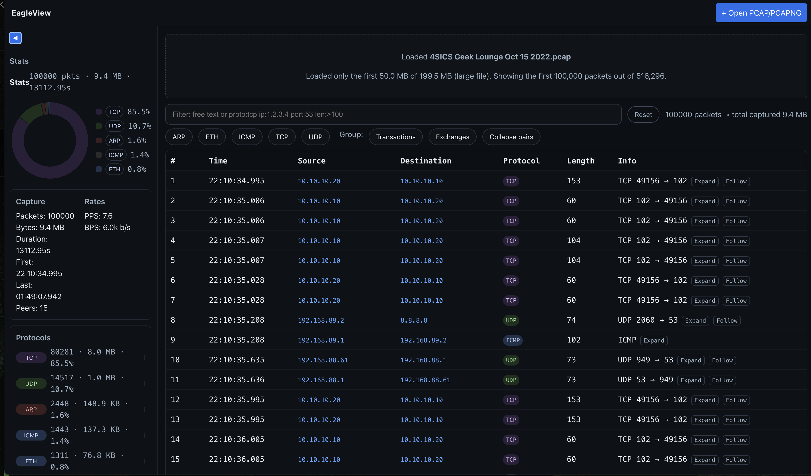

# EagleView (Web UI)



EagleView is a lightweight, client-side dashboard for exploring packet captures (pcap/pcapng) with protocol-aware summaries, flow/transaction grouping, and quick hex previews. It runs fully in the browser—no backend required.

## Features
- Load .pcap or .pcapng files (drag & drop or file picker)
- Protocol tagging at a glance (ARP/DNS/TCP/UDP/HTTP/TLS/SMB/SIP/RTP/…)
- Filters by protocol, IP/peer, flow, simple tokens (e.g. `proto:DNS ip:10.0.0.1`)
- Views: flat list, grouped by peer, grouped by transaction (DNS, TCP SYN/ACK, etc.)
- Stream view: extract best-effort L4 payloads for quick inspection
- Supports VLAN, PPPoE, MPLS, IPv4/IPv6, and many L4/L7 protocols

See protocol coverage and where decoding happens in `../docs/PROTOCOLS.md` and `src/lib/decoders.ts`.

## Getting started

Prereqs: Node.js (LTS) and pnpm/npm/yarn.

```sh
# inside eagleview/
npm install
npm run dev
# build for production
npm run build
# preview local build
npm run preview
```

Then open the app, drop a pcap/pcapng file, and explore.

## How it works
- `src/lib/parsers.ts`: minimal PCAP/PCAPNG readers in the browser
- `src/lib/decoders.ts`: fast, heuristic L2/L3/L4/L7 tagger (no heavy parsing)
- `src/App.tsx`: UI with list/group/txn views, filters, and stream extractor

The tagger recognizes common protocols by header/port/heuristics (e.g., QUIC, RTP/RTCP, SIP, SMB, TLS SNI presence, DHCP, DNS names). It aims to be helpful and fast—not a strict validator.

## Tips
- Use the protocol chips to quickly filter; click again to toggle multiple
- Type filters to refine results (e.g., `proto:TCP ip:192.168.1.10 port:443 dns:example.com`)
- Switch to Grouped view to see peers, bytes, and protocol mix; expand for samples
- Turn on Transaction grouping to bucket DNS IDs and TCP handshakes
- Use Stream view to preview application payload slices for a selected flow

## Large captures and limits
EagleView runs entirely in the browser. To avoid crashes on low-memory devices:
- Files larger than ~250 MB are rejected.
- Files larger than ~50 MB load only the first 50 MB.
- When packet count is extremely high, only the first 100,000 rows are retained in memory for responsiveness.

If you need to analyze a huge capture, consider trimming before loading:
- By time window (editcap): `editcap -A 2025-01-01 00:00:00 -B 2025-01-01 00:10:00 big.pcap out.pcap`
- By packet count (editcap): `editcap -c 100000 big.pcap out.pcap`
- By filter (tcpdump): `tcpdump -r big.pcap '(host 1.2.3.4 and port 443)' -w out.pcap`
- By display filter (tshark): `tshark -r big.pcap -Y 'ip.addr==1.2.3.4 && tcp.port==443' -w out.pcap`

These keep the UI stable while still letting you inspect relevant traffic.

## Related
- Core Rust decoders live in `../src/protocols/*` (CLI utilities).
- High-level protocol list: `../README.md` and `../docs/PROTOCOLS.md`.

## License
MIT
